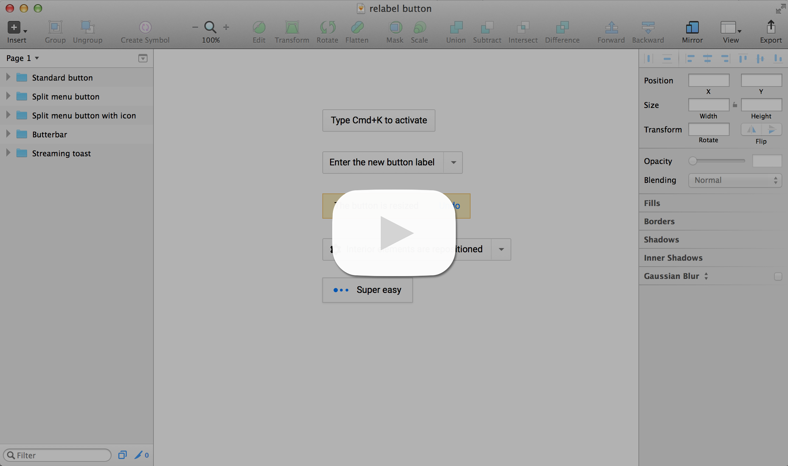

# Relabel Button plugin for Sketch <span style="color:red">(Requires Sketch v44 or later)</span>

The Relabel Button plug-in for [Sketch.app](http://bohemiancoding.com/sketch/) prompts for a button's new label then applies the text, resizes the button background and repositions any other interior elements while maintaining the existing padding.


## Demo


[](http://www.youtube.com/watch?v=14IKFvKiNqM)


## Usage
* Select any group or symbol that contains a text layer and one or more other layers (dividers, icons, drop-arrows, etc)
* Press Cmd+J and enter the new text for the button (or Cmd+Ctrl+J for right aligned resize)

That's it!  The text and other objects will be updated maintaining the button's original padding and relative layout.

## Guidelines
* nested groups not supported
* for symbols, elements SHOULD NOT be placed within a group
* for symbols, child elements should have Resizing set to Pin To Corner so they do not get shrunk/stretched
* see the [Relabel Button Guidelines](https://github.com/kenmoore/sketch-relabel-button/raw/master/Relabel%20Button%20Guidelines.sketch) Sketch file for example buttons

## Changing the Default Keyboard Shortcut

1. Choose "Reveal Plugins Folder..." from Sketch's Plugins menu.
2. Open the file "Relabel Button.sketchplugin" in a text editor.
3. Edit the shortcut specification at the end of the first line:

    ```
    // Relabel Button Plugin (cmd j)
    ```


## Credits
Many thanks to [Alexander Kudymov](https://github.com/ddwht), who wrote the [Dynamic Button plugin](https://github.com/ddwht/sketch-dynamic-button) which I modified.

Also thanks to [@fuggfuggfugg](https://github.com/fuggfuggfugg), who graciously shared useful code for manipulating symbols.


[Twitter](https://twitter.com/itskenmoore)


